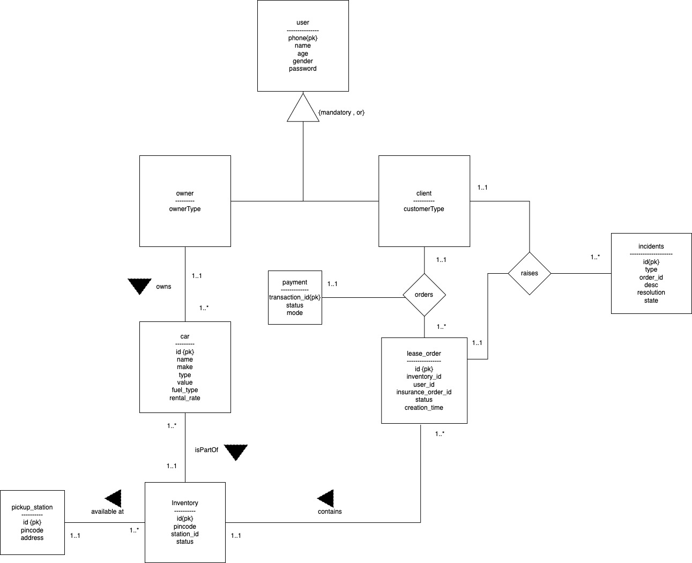

# ZipCarClone
Database project to clone zipCar.<br/>
Project uses :
- nodejs for server.
- Mysql for database.
- Embedded JS for frontend.


# HOW TO START APPLICATION
 - Setup Databsase as mentioned in the point 2.
 - Run ```npm install``` to install all node_modules to your developement environment.
 - Run ```npm start``` to start the zipcar server.
 - You should be able to access the backend apis at http://localhost:7000/

# How to setup zipcar database schema from workbench.
 - Run  ```sqlInitDbSetup.sql``` in workbench. This will create the zipcar user , zipcar db and grant priveledges to the user.
 - Run ```sqlCreateTables.sql``` in workbench to create tables.
 - Run ```sqlProcedures.sql``` in workbench to create procedures / functions and other database programming objects.
 - Run ```sqlTriggers.sql``` in workbench to create the trigger that backsup the deleted cars into a backupCars table.

# How to make Database migrations from sequelize 
 - Install ```sequelize-mig``` to create migrations from your database models.
 - Run ```sequelize-mig migration:make -n mega_migration``` , you should see the mega-migration created inside your migrations folder.
 - Run the migration using  ```npx sequelize-cli  db:migrate``` to create the physical tables in the database.

# Database Schema 
